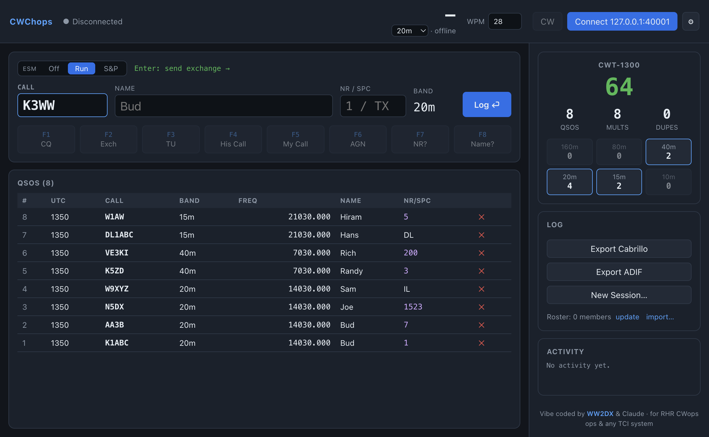
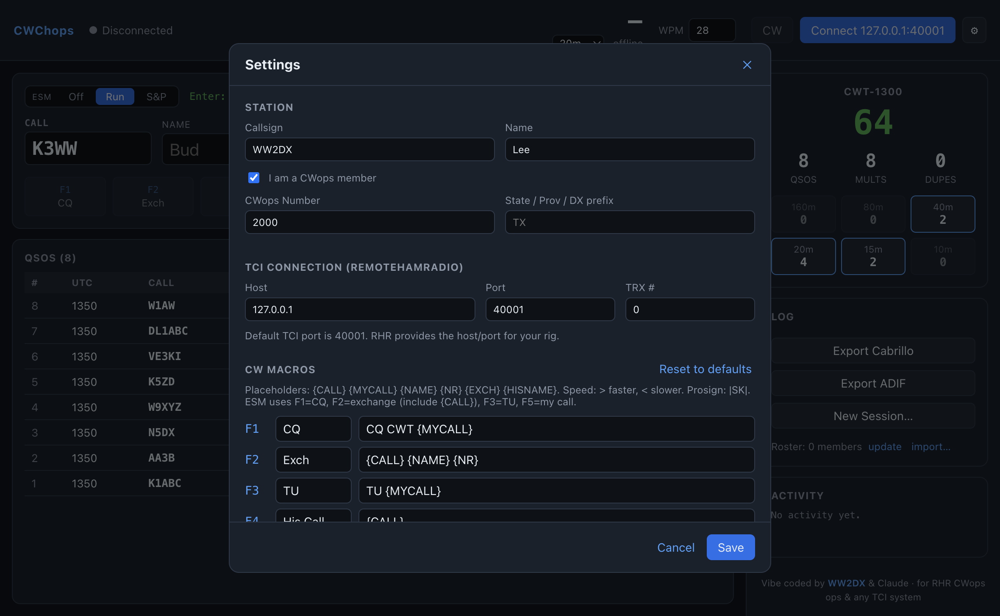

# CWChops

[](https://github.com/OWNER/CWChops/actions/workflows/ci.yml)
[](https://github.com/OWNER/CWChops/actions/workflows/release.yml)
[](https://github.com/OWNER/CWChops/releases/latest)
[](LICENSE)

A cross-platform contest logger for the **CWops CWT** (CWops Tests), with rig
control over **TCI** only — built for **RemoteHamRadio (RHR)** TCI connections.

> Vibe coded by **WW2DX** and Claude — for RHR CWops operators, and any other
> TCI-supported system.



- **Desktop app** (Windows / macOS / Linux) — Electron + React + TypeScript.
- **TCI-only** rig control (Expert Electronics TCI protocol over WebSocket).
- **CW sending** via TCI CW macros, driven by F-key macros and the keyboard.
- **ESM (Enter Sends Message)** — work a run almost entirely from the Enter key, with Run / S&P modes.
- **CWT scoring** in real time, dupe checking per band, **Cabrillo** + **ADIF** export.
- **Member-number autofill** that auto-updates from the official CWops roster.
- **No native dependencies** — uses the built-in `node:sqlite` for durable storage.

## Download

Grab the installer for your platform from the
**[latest release](https://github.com/OWNER/CWChops/releases/latest)**:

| Platform | File |
|----------|------|
| **macOS** (Apple Silicon / Intel) | `CWChops-<version>-arm64.dmg` · `…-x64.dmg` |
| **Windows** | `CWChops-Setup-<version>.exe` |
| **Linux** | `CWChops-<version>.AppImage` · `…_amd64.deb` |

The app is not code-signed/notarized, so the first launch needs an extra step:

- **macOS:** right-click the app → **Open** (or `xattr -dr com.apple.quarantine /Applications/CWChops.app`).
- **Windows:** SmartScreen → **More info** → **Run anyway**.

## Screenshots

| Logging a CWT | Settings |
|---|---|
|  |  |

## Build from source

```bash
npm install
npm run dev        # launch in development (hot reload)
```

Other scripts:

```bash
npm test           # unit + integration tests (Vitest)
npm run test:e2e   # build + UI smoke test driving the real app (Playwright/Electron)
npm run typecheck  # tsc on the node + web projects
npm run build      # build main/preload/renderer bundles
npm run make       # build + package installers for the current OS (electron-builder)
```

Installers for all three OSes are built by CI on every `v*` tag — see
`.github/workflows/release.yml`.

## First-run setup

On first launch the **Settings** dialog opens automatically. Enter:

- **Station** — your callsign and first name; if you're a CWops member, tick the
  box and enter your member number; otherwise enter your State/Province/DX prefix.
- **TCI Connection** — the host/port of your RHR TCI server. The TCI default port
  is **40001**; RHR provides the host/port for your rig. `TRX #` is the
  transceiver index (0 for the first/only one).
- **CW Macros** — F1–F8 messages (editable). Placeholders:
  `{CALL} {MYCALL} {NAME} {NR} {EXCH} {HISNAME}`. Use `>`/`<` to bump CW speed
  up/down mid-message and `|SK|` for a prosign.

## Logging a contest

1. Click **Connect**. When the status dot turns green the radio's frequency,
   band and mode are mirrored live.
2. Type the worked **Call**, press **Enter** to move to **Name**, then **Nr/SPC**
   (a member number like `1`, or a state/prov/DX prefix like `TX`). **Enter** on the
   last field logs the QSO. A red **DUPE** badge appears if you've already worked
   that call on this band, and the roster autofills Name + Nr when the call is known.
3. **F1–F8** send CW macros; **Esc** stops sending immediately.
4. The sidebar shows the live score (QSOs × unique calls), per-band counts, and
   dupes. Export **Cabrillo** (for submission, `CONTEST: CWOPS`) or **ADIF** when done.

If the radio isn't connected you can still log offline — pick the band from the
dropdown in the header; QSOs record a representative frequency for that band.

### ESM (Enter Sends Message)

ESM overloads the **Enter** key to send the right CW message for where you are in
the QSO, so you can run with almost no F-keys. Toggle **Off / Run / S&P** above the
entry fields; the green hint shows what Enter will do next. The mode is remembered.

**Run** (you're calling CQ):

| Field state | Enter sends |
|---|---|
| Call empty | **CQ** (F1) |
| Call entered | your **exchange** — his call + your name/number (F2); cursor moves to the exchange field |
| His exchange copied | **TU** (F3) **and logs** the QSO |

**S&P** (you're answering CQs):

| Field state | Enter sends |
|---|---|
| Call entered | your **call** (F5) to answer |
| His exchange copied | your **exchange** (F2) **and logs** the QSO |

F1–F8 still work directly at any time, and **Esc** always stops sending. ESM only
keys TU/logs once the exchange field actually parses into a name + number/SPC.

## CWops roster (autofill)

The member roster powers name + number autofill from a callsign. It updates
**automatically from the official CWops roster** (a public Google-Sheets CSV
export, ~3,300 members) — on first run and then weekly in the background. You
can also force a refresh via **Settings → Update from CWops** (or the sidebar
**update** link). The roster is cached locally and works offline between updates.

You can alternatively **import a CSV** manually (Settings → Import CSV) in the
format `callsign,name,number`, one member per line.

## CWT rules (implemented)

- Sessions: Wed 1300z & 1900z, Thu 0300z & 0700z, 60 min each.
- Bands: 160/80/40/20/15/10 m, CW only.
- Exchange: members send name + CWops number; non-members send name + SPC.
- Scoring: 1 point per QSO (work each station once **per band**); multiplier =
  number of unique callsigns worked; score = QSOs × mults.
- Submit at <https://3830scores.com> within 48 h (Cabrillo optional/secondary).

## Architecture

```
src/
  shared/    pure logic + types shared by both processes
             (scoring, bands, exchange parsing, session labels, IPC contract)
  main/      Electron main process
    tci/     TCI WebSocket client + protocol command builders/parser
    db/      node:sqlite store (contests, QSOs, settings)
    export/  Cabrillo + ADIF writers
    members/ roster lookup
    ipc.ts   IPC handlers   index.ts  app lifecycle
  preload/   contextBridge — exposes the typed `window.api`
  renderer/  React UI (RadioBar, EntryForm, LogTable, Scoreboard, SettingsPanel)
```

The renderer never touches Node APIs; everything goes through `window.api`
(see `src/shared/api.ts`). The TCI protocol details live in
`src/main/tci/protocol.ts` (command format, reserved-char escaping `:`→`^`,
`,`→`~`, `;`→`*`).
